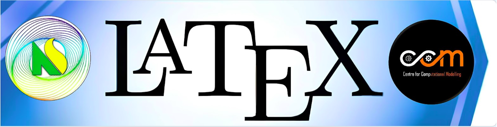
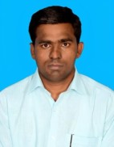

# Hands on LaTeX Workshop

## Objectives

The workshop will cover the following titles:

* Installation of complete ISO file
* Structure of LaTeX Document
* Tables & Figures
* Math equations
* Bibliography
* Article & Thesis
* Beamer
* Posters & Resumes
* Certificates

## Audience

* People who associated with academia & research labs
* Inparticular,
  * Researchers who are about to submit thesis, final year undergraduate and post graduate students
  * Conference attendes and organizers
* and other people who require professional type setting

## Resource Persons

1. Dr. Aravinthan​ Devarasu  
Senior Lecturer and Head,  
Department of  ​Sciences,  
Mathematics and Education, St. Joseph University in Tanzania, Dar Es Salaam, Tanzania.

2. Dr. Sabarathinam Srinivasan

3. Dr. P. A. Praveen

4. Dr. S. Leokingston

## Detailed Work Plan

### Day ZERO (26 March 2024 -- CITAR IDEA lab): Getting Ready  ( Dr. Manikandan, Dr. Dianavinnarasi and Dr. Dinesh Vijay -- CNS and CCM)

* Installation using ISO file 
* Preffered editors and PDF viewers

### Day ONE (March 27th 2024): Hands-on 1: Basics (Dr. D. Aravinthan)

* Preamble & code
* Sections
* Formating the document
* Error messages & debugging
* Compiling using PDFlatex
* Turn ON & OFF: Page Number, Section number etc.
* Typing MATH

### Day ONE (March 27th 2024): Hands-on 2: Tables & Math (Dr. S. Sabarathinam)

* Equations: Integrals, Matrices, Summation, Differention etc.
* Tables & Figures
* Bibliography
* Report, Article, Chapter, Thesis
* Relevant packages

### Day TWO (April 3rd, 2024): Hands-on 3: Beamer, Resume and Posters (Dr. Leokingston)

* Basic beamer
* Resume templates
* Poster templates
* Manuscript preparation for different journals

### Day TWO (April 3rd, 2024): Hands-on 4: (Dr. P. A Praveen)

* Version control
* Overleaf
